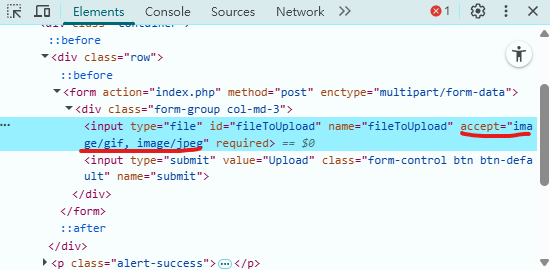
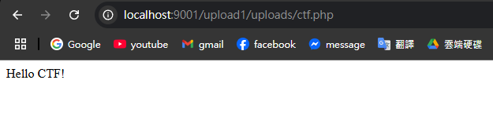
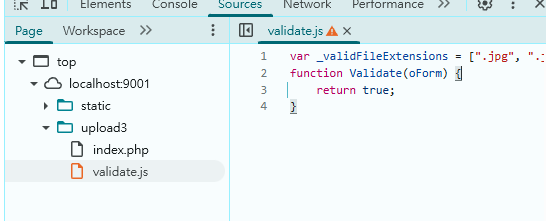

# file upload vulnerability

ref: `https://github.com/moeinfatehi/file_upload_vulnerability_scenarios`

本題因為書籍提供的題目已損毀，自己找一題來玩。

## Solution

### upload1

使用 client 端 html form 來封鎖非法檔案，直接在 browser 中刪掉限制。

之後上傳 `./ctf.php` 檔案，成功上傳後，讀取該檔案會執行任意 php code。

### upload3

題目: `http://localhost:9001/upload3/`

這題也只在前端較驗，額外用 JS 做白名單檢查，在 browser 中竄改 JS 來繞過檢查。

### upload10

goto http://localhost:9001/upload10/

用後端黑名單防禦

使用特殊名繞過，把 `ctf.php` 改成 `.php5`，成功上傳後，讀取該檔案會執行任意 php code。

### upload11

用後端黑名單防禦

使用副檔名黑名單，使用大小寫繞過 `ctf.pHp5` 也能成功上傳。

## note

先寫幾題感受一下即可，就不全寫完了，題目重複性很高
