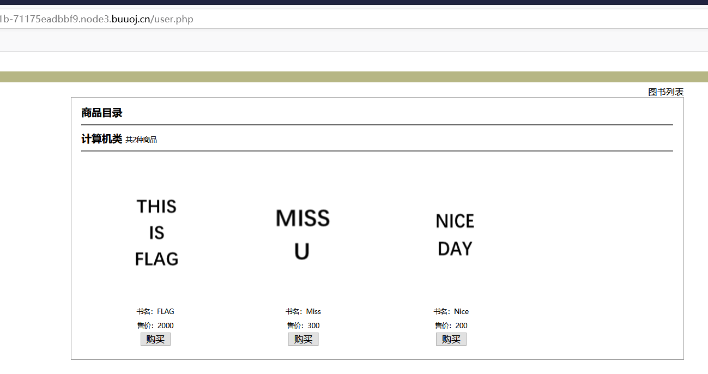
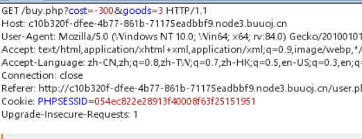

# Web Logic

## ref SOL

題目無權限下載，僅提供 solution

---

Author: SuperJason
Date: 2020-12-28

---

### flag

`FLAG{you_can_got_it}`

### 思路

1. 打开题目环境，任意输入用户名、密码，得到以下界面

2. 无法直接购买 flag 书籍，显示钱不够，通过 burpsuite 抓包分析购买操作。发现 cost 参数和 goods 参数。利用逻辑漏洞给书籍价格添加负值价格，增加 money，然后可以购买 flag。

