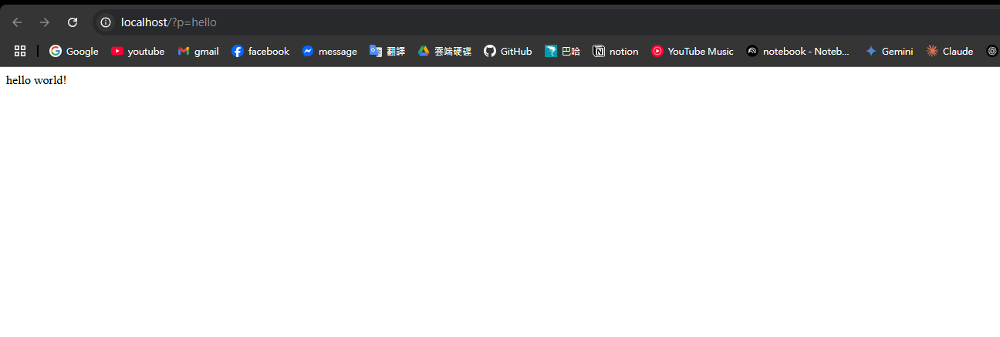
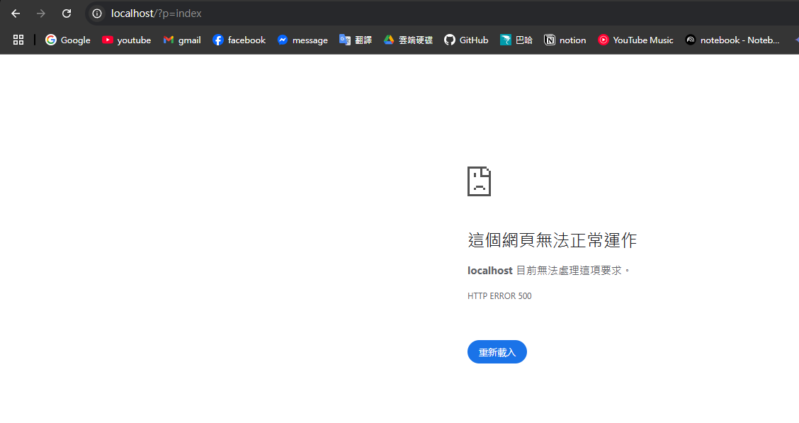
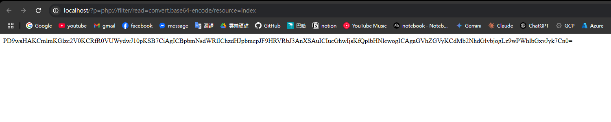

# read any file Q1

## Solution

打開網站後自動導航到 `http://localhost/?p=hello`

看到參數名稱為 p，這是 php 的 file pointer 的習慣命名。

所以猜測，hello 指向 hello.php 文件。裡面包含印出 "Hello, World!" 的程式碼。

隨意輸入常見檔名，如: home(home.php), index(index.php) 等等

在 `http://localhost/?p=index`，會顯示伺服器崩潰。

這表示該處確實存在某個名為 index 的東西，並且觸發資安阻擋。

既然猜測是 php 使用 file pointer 又知道 index 處有東西

所以可以嘗試使用 php 的 base64 filter 可以指向任意文字檔案當字串 echo 出來。

在 `http://localhost/?p=php://filter/read=convert.base64-encode/resource=index`，會顯示 base64 編碼的 index.php 內容。

解碼後為合理的 php 代碼。

還可以額外測試 `http://localhost/?p=php://filter/read=convert.base64-encode/resource=hello`，會看到入口顯示的 hello world 的程式碼來源。

至此可以確認該處存在 php file pointer 漏洞。

可以隨意測試地址來找 flag，常見是直接讀取 `flag.php` 或 `config.php` 等等。

在 `http://localhost/?p=php://filter/read=convert.base64-encode/resource=flag`，會顯示 base64 編碼的 flag 內容。
