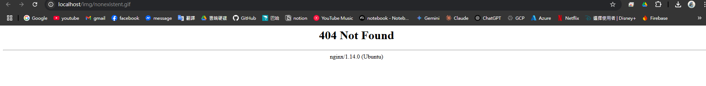
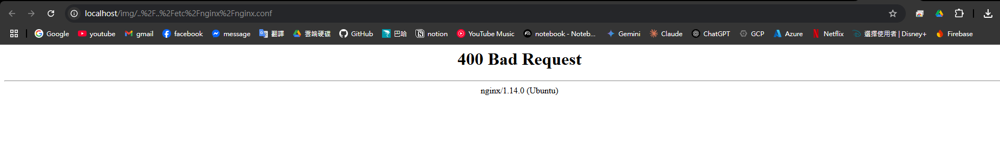
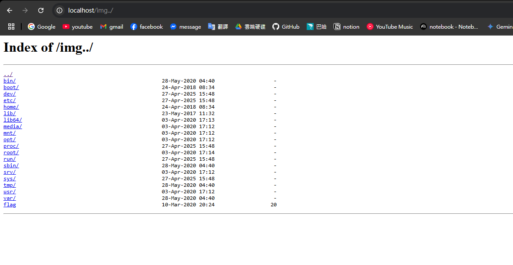

# any file read Q2

網頁有一張 gif，透過瀏覽器抓到圖片網址是 `http://localhost/img/img.gif`

前往 `http://localhost/img/` 可以看到資料夾可以確定是阿帕契或 nginx 伺服器

嘗試不存在的圖片 `http://localhost/img/nonexistent.gif` 會顯示 404 錯誤

根據預設報錯可以大概率猜測是 nginx，因此嘗試 nginx 的常見設置錯誤

嘗試 `http://localhost/img/..%2F..%2Fetc%2Fnginx%2Fnginx.conf` 會顯示 400 錯誤，表示有基本的防護措施不能無腦上一層到底

最後嘗試 `http://localhost/img../` 會成功進入根目錄資料夾，找到檔案 flag 並獲取內容

