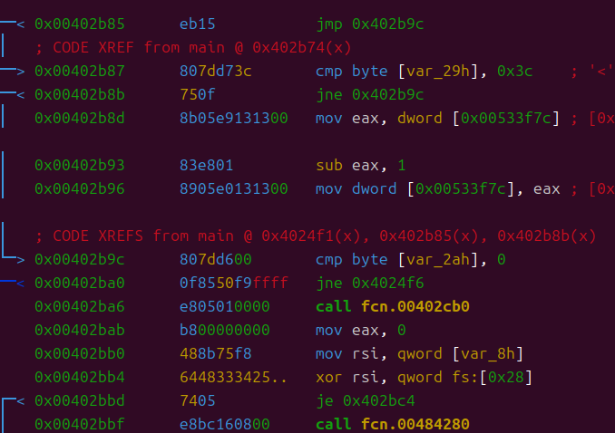
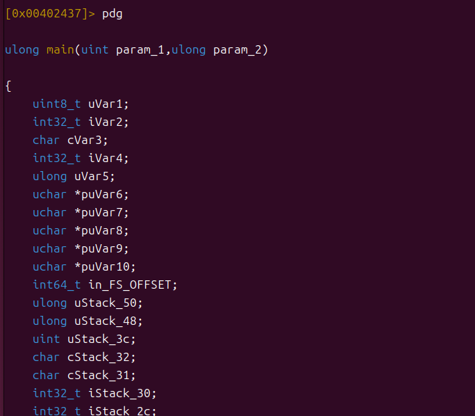
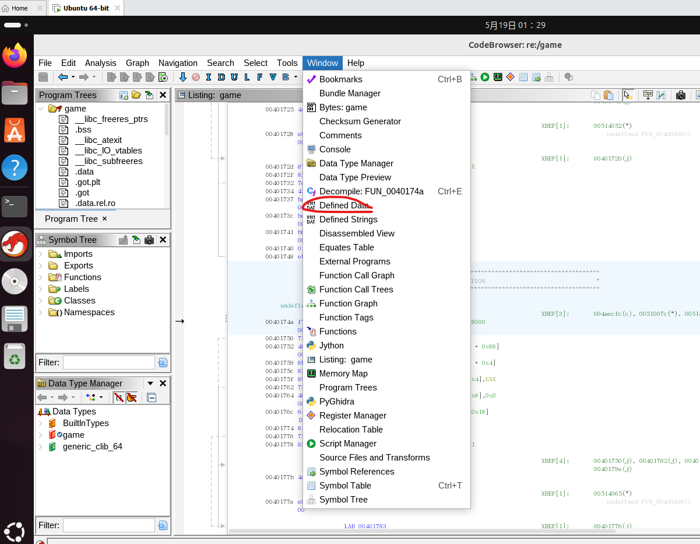
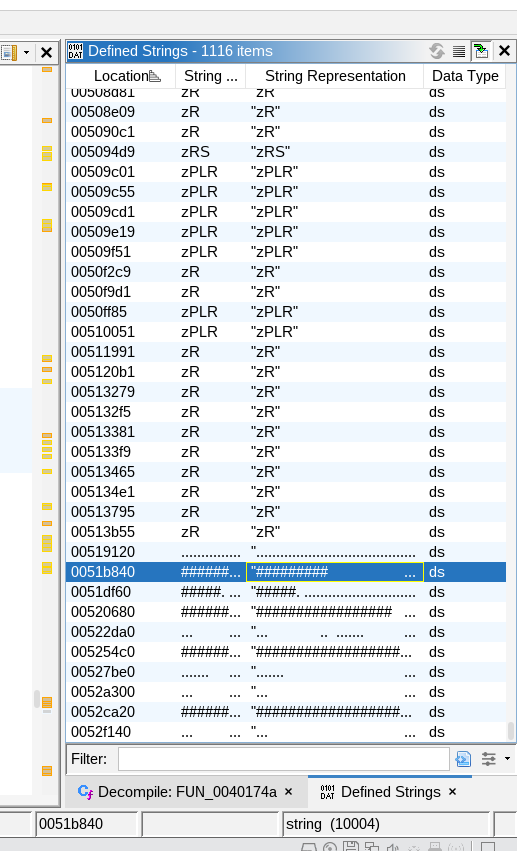
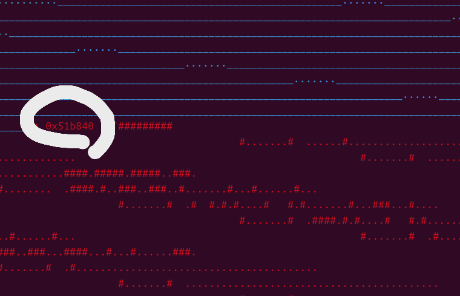
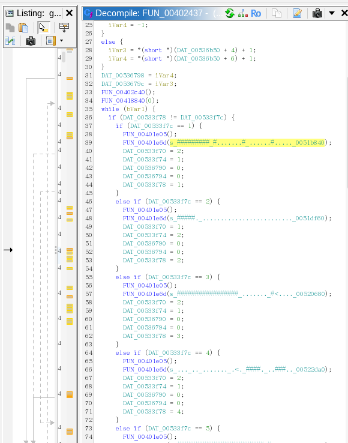

# Wizardlike

ref: https://play.picoctf.org/practice/challenge/318

## ENV

先預備以下逆向工具於 ubuntu

- https://github.com/radareorg/radare2 : 逆向用 debugger
- https://github.com/NationalSecurityAgency/ghidra : 靜態分析工具
- https://github.com/radareorg/r2ghidra : `radare2` debugger 時動態調用靜態分析工具 `ghidra`

## SOLUTION

按照慣例，先使用 ghidra 開啟 `game`，嘗試反編譯，會發現找不到 main

這是典型的套殼案例，即因為某種目的(壓縮或加密)，會在軟體執行時動態解開原始碼後才執行，所以此時靜態分析看到的是解開殼的 entry point

改成用 `radare2` 做動態分析:

- 使用 `r2 game`
- 使用 `aaa` 分析全部原始碼 (analysis all)
- 使用 `afl | grep main` 列出所有函數找 main
- 確定找到後用 `s main` 跳到該段落
- 用 `pdf` 列出組合語言
  
- 用 `pdg` 調用插件 `r2ghidra` 印出反編譯 C 語言
  

解讀反編譯的結果，可以發現總共有 10 個關卡，而且沒有明顯會產生 flag 的段落

但是發現關卡的字串很長很特殊，進入 `ghidra` 用 `defined string` 抓出來





複製出來貼上隨便一張(後來發發現剛好第一張)，認真看發揮想像力，竟然寫著 `picoCTF{`，很明顯暗示了 flag 寫在地圖裡

```
#########                                                                                           #.......#  ......#...................................                                               #.......#  ....................####.#####.#####..###.                                               #........  .####.#..###..###..#.......#...#......#...                                               #.......#  .#  #.#.#....#   #.#.......#...###...#....                                               #.......#  .####.#.#....#   #.#.......#...#......#...                                               #.......#  .#....#..###..###...####...#...#......###.                                               #.......#  .#........................................                                               #.......#  ..........................................                                               #.......#                                                                                           #.......#                                                                                           #.......#                                                                                           #.......#                                                                                           #.......#                                                                                           #......>#                                                                                           #########
```

所以後續的任務就是按照關卡順序把對應的地圖複製出來

在 r2 的 `pdf` 命令可以找到各關卡字串的指標，拿到 `ghidra` 的 `defined String` 可以拿出來複製貼上



第一關剛好是以下內容

```
#########                                                                                           #.......#  ......#...................................                                               #.......#  ....................####.#####.#####..###.                                               #........  .####.#..###..###..#.......#...#......#...                                               #.......#  .#  #.#.#....#   #.#.......#...###...#....                                               #.......#  .####.#.#....#   #.#.......#...#......#...                                               #.......#  .#....#..###..###...####...#...#......###.                                               #.......#  .#........................................                                               #.......#  ..........................................                                               #.......#                                                                                           #.......#                                                                                           #.......#                                                                                           #.......#                                                                                           #.......#                                                                                           #......>#                                                                                           #########
```

試著貼上[第二關](./L2.map.txt)，注意，可以使用原生的 txt 編輯器，用 vscode 等進階工具，往往會自動校正，導致看不出效果

得: `ur_4_w1z4rd_`

後續按照各個關卡依序貼上，可以回到基於 r2 找到 main 的行數回到靜態分析看原始碼，也很方便



1. 51b840
2. 51df60
3. 520680
4. 522da0
5. 5254c0
6. 527be0
7. 52a300
8. 52ca20
9. 52f140
10. 531860

複製出來後按照 100 個字元換一次行做手工藝，最終可以得到 flag

工程浩大，我就不演示了
